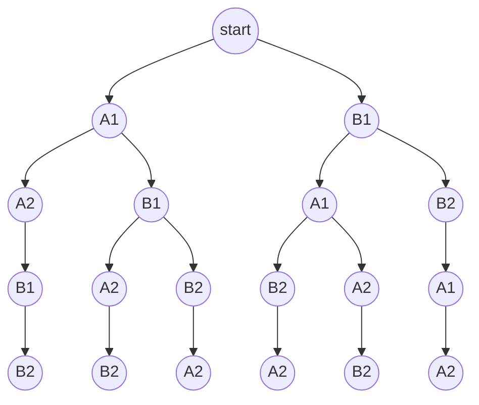

# shuffler

A concurrency testing tool for python. Aims to help finding concurrency issues by exploring various possible interleavings of atomic operations within multiple concurrent threads/coroutines.

> [!WARNING]  
> This is a PoC implementation, not properly tested yet

## Intro

Consider the following example:

```python
import asyncio
import random

db: dict[str, int] = {}


async def simulate_io() -> None:
    await asyncio.sleep(random.uniform(0, 0.01))


async def set_value(key: str, value: int) -> None:
    await simulate_io()
    db[key] = value


async def get_value(key: str) -> int:
    await simulate_io()
    return db[key]


async def increment(key: str) -> None:
    value = await get_value(key)     # (1)
    await set_value(key, value + 1)  # (2)
```

2 concurrent calls to `increment("mykey")` can lead to a race condition, resulting in a [lost update](https://en.wikipedia.org/wiki/Write%E2%80%93write_conflict) anomaly. The bug occurs only when operations happen in a specific order. 

If we denote two concurrent coroutines with letters ($A$, $B$) and each operation with a number, here are all the possible execution orderings (interleavings) of operations:

```
A1 – A2 – B1 – B2
A1 – B1 – A2 – B2
A1 – B1 – B2 – A2
B1 - A1 - B2 - A2
B1 - A1 - A2 - B2
B1 – B2 - A1 – A2
```

Or, as a tree:



The total number of possible interleavings in a general case can be found as
```math
\frac{(n_1+n_2+\cdots+n_k)!}{n_1!n_2!\cdots n_k!}
```
where $k$ is the number of concurrent threads/coroutines each of which executes $n_i$ operations.

Let's say we'd like to explore all of the 6 possible interleavings of our double increment example:

```python
from shuffler.shufflers import AsyncioShuffler
from shuffler.strategies import ExhaustiveStrategy

shuffler = AsyncioShuffler(pool_size=2, strategy=ExhaustiveStrategy())

async def increment(key: str, task_id: str) -> None:
    async with shuffler.shuffle(task_id):
        value = await get_value(key)
    async with shuffler.shuffle(task_id):
        await set_value(key, value + 1)

async def main():
    key = 'mykey'
    while not shuffler.strategy_completed():
        await set_value(key, 0)
        await asyncio.gather(
            increment(key, task_id='A'),
            increment(key, task_id='B'),
        )
        sequence = shuffler.finish_sequence()
        value = await get_value(key)
        print(f'{sequence=}, {value=}')

asyncio.run(main())
```
Output:
```
sequence=['A', 'A', 'B', 'B'], value=2
sequence=['B', 'A', 'A', 'B'], value=1
sequence=['A', 'B', 'A', 'B'], value=1
sequence=['A', 'B', 'B', 'A'], value=1
sequence=['B', 'B', 'A', 'A'], value=2
sequence=['B', 'A', 'B', 'A'], value=1
```

## Usage

Low-level API provides a `AsyncShuffler` class for asyncio and `ThreadingShuffler` for threads, and requires user to manually wrap each operation in `with shuffler.shuffle(...)` block, as shown in the previous snippet.

Two strategies for exploring interleavings are implemented: `RandomStrategy` (with `max_iterations` parameter controlling the number of iterations) and `ExhaustiveStrategy`.

There's also `plugins.sqlalchemy` module that allows to explore concurrent anomalies of SQL queries and can be plugged in via SQLAlchemy's [Events API](https://docs.sqlalchemy.org/20/core/event.html), no touching of the code under test required.

See [tests](tests/) for more examples.

## Development

```bash
python3.12 -m venv venv
source venv/bin/activate
poetry install
git config core.hooksPath .githooks
pytest
```

